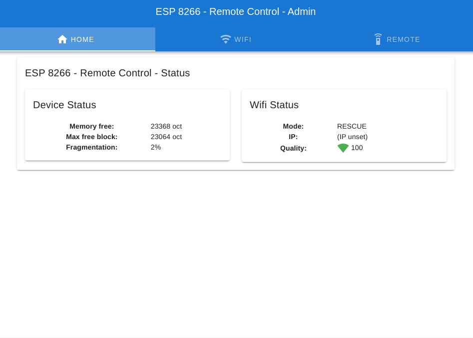
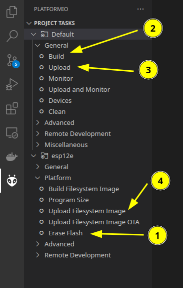
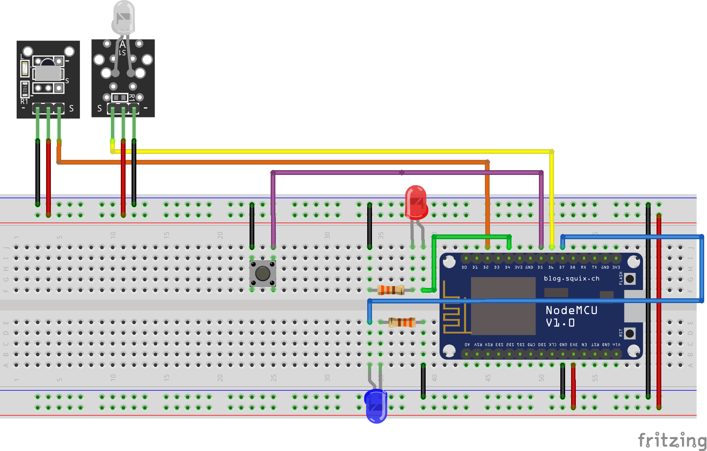
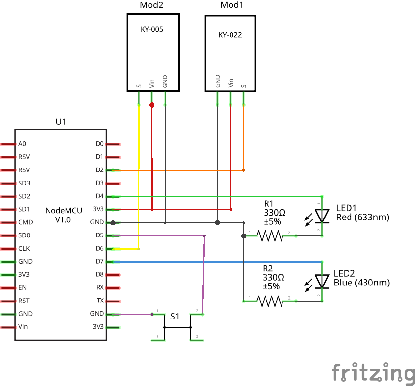

# IR Remote by WiFI

It's a esp8266 Remote IR managed by WiFi API and HTML5 Admin.




## Usage

Use your remote for send a key signal. After open admin for stre your signal with string key.

And for finish send signal by API.

The red led is hear for status of device.
 - Up and don't blink. Connected on WiFi
 - Blink. Is mode rescue enabled
 - Blink 4 and stop. SPIFF main error

The blue led blink on signal send.

The button enable rescue mode. But if long press, reset all configration.


## API


### Device

`GET /api/status`

Return status of the device

**Body response**:
```ts
{
    "fragmentation": number,  // Memory fragmentation in %
    "max_free_block": number, // Memory free for create block on device in Bytes
    "memory_free": number     // Memory free on device in Bytes
}
```


### IR


`GET /api/ir/history-receive`

Return list of receive signal (not stored). 10 max.

**Body response**:
```ts
[
    {
        "id": number,                   // Id use only dor store signal
        "raw_code": number[],           // Raw data if not decoded
        "received_ir_data": {           // Decoded signal data
            "address": number,
            "command": number,
            "decodedRawData": number,
            "extra": number,
            "flags": number,
            "numberOfBits": number,
            "protocol": number
        }
    },
    ...
]
```


`GET /api/ir/store`

Return list of stored signal keys

**Body response**:
```ts
[ string ]    // List of stored signal keys
```


`GET /api/ir/store?key=KEY`

Return detail of stored signal by key

**Params request**:
```ts
key: string // Key of stored signal 
```

**Body response**:
```ts
{
    "id": number,                   // Id (don't used now - not uniq)
    "raw_code": number[],           // Raw data if not decoded
    "received_ir_data": {           // Decoded signal data
        "address": number,
        "command": number,
        "decodedRawData": number,
        "extra": number,
        "flags": number,
        "numberOfBits": number,
        "protocol": number
    }
}
```


`POST /api/ir/store`

Store a signal by key and id of history receive

**Body request**:
```ts
{
    "id": number,  // Id of signal in history receive
    "key": string  // Key dor store signal
}
```

**Body response**:
```ts
{
    "id": number,                   // Id (don't used now - not uniq)
    "raw_code": number[],           // Raw data if not decoded
    "received_ir_data": {           // Decoded signal data
        "address": number,
        "command": number,
        "decodedRawData": number,
        "extra": number,
        "flags": number,
        "numberOfBits": number,
        "protocol": number
    }
}
```

`POST /api/ir/delete?key=KEY`

Delete stored signal by key

**Params request**:
```ts
key: string // Key of stored signal 
```

**Body response**:
```ts
{ "success": true }
```

`POST /api/ir/send`

Send list of signals on IR led

**Body request**:
```ts
[                          // List of signal
    {
        "value": string    // Key of stored signal
        "repeat": number,  // (optional) Milli-second for repeat signal
        "wait": number     // (optional) Milli-second wait after send signal
    },
    ...
]
```

**Body response**:
```ts
[                          // Copy of send info
    {
        "value": string 
        "repeat": number,
        "wait": number 
    },
    ...
]
```


`POST /api/ir/restore?key=KEY`

Restore full signal with key and data

**Params request**:
```ts
key: string // Key of stored signal 
```

**Body request**:
```ts
{
    "id": number,                   // Must be set but not used can be 0
    "raw_code": number[],           // Raw data if not decoded
    "received_ir_data": {           // Decoded signal data
        "address": number,
        "command": number,
        "decodedRawData": number,
        "extra": number,
        "flags": number,
        "numberOfBits": number,
        "protocol": number
    }
}
```

**Body response**:
```ts
{                                 // Copy of send request
    "id": number,  
    "raw_code": number[], 
    "received_ir_data": {
        "address": number,
        "command": number,
        "decodedRawData": number,
        "extra": number,
        "flags": number,
        "numberOfBits": number,
        "protocol": number
    }
}
```

### WiFi

`GET /api/wifi/status`

Return current wifi status

**Body response**:
```ts
{
    "ip": string                      // Ip of device or "(IP unset)",
    "mode": "RESCUE"|"AP"|"STATION",  // Mode of wifi  
    quality: number                   // Quality of signal WiFi in %
}
```

`GET /api/wifi/scan`

Return lists of signals wifi detected

**Body response**:
```ts
[
    {
        "bssid": string,
        "channel": number,
        "encryption_type": string,
        "is_hidden": boolean,
        "quality": number,
        "ssid": string
    },
    ...
]
```


`GET /api/wifi/config`

Return current configuration

**Body response**:
```ts
{
    "dhcp": "DHCP"|"DHCP_DNS"|"STATIC",
    "dns1": string,
    "dns2": string,
    "gateway": string,
    "ip": string,
    "mask": string,
    "mode": "AP"|"STATION",
    "password": string,
    "ssid": string
}
```

`POST /api/wifi/config`

Send new configuration

**Body request**:
```ts
{
    "dhcp": "DHCP"|"DHCP_DNS"|"STATIC",
    "dns1": string,
    "dns2": string,
    "gateway": string,
    "ip": string,
    "mask": string,
    "mode": "AP"|"STATION",
    "password": string,
    "ssid": string
}
```

**Body response**:
```ts
{
    "dhcp": "DHCP"|"DHCP_DNS"|"STATIC",
    "dns1": string,
    "dns2": string,
    "gateway": string,
    "ip": string,
    "mask": string,
    "mode": "AP"|"STATION",
    "password": string,
    "ssid": string
}
```

## Flash ESP 8266

Import in VSCode PIO project (https://docs.platformio.org/en/latest/integration/ide/vscode.html)

 - 1 - Reset the flash data
 - 2 - Build project
 - 3 - Push in node MCU
 - 4 - Upload static file for web admin



## Diagrams






## Dev front admin

The front is create in VueJs and Vuetify

For build in dev mode:

```
cd vue
npm run serve
```

For recreate spiff final files:

```
cd vue
npm run deploy
```
